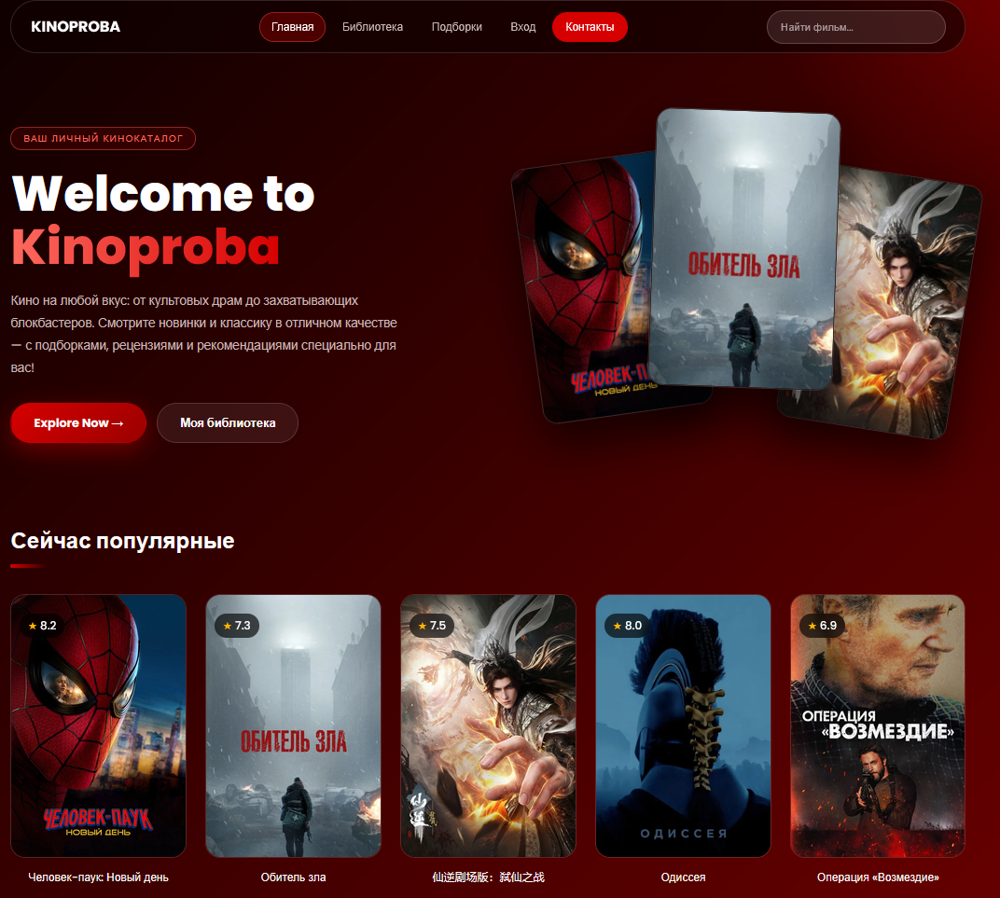

# 🎬 KINOPROBA — каталог фильмов и сериалов
 
Веб-система каталогизации медиаконтента с ручным и автоматическим (TMDB) пополнением, поддержкой типов контента, рецензиями, подборками и аналитикой просмотров.
 
Проект для конкурсной задачи **«Кинопроба»** Международного фестиваля научно-технического творчества детей и молодёжи **«Хайтек.Юниоры»**.



---
 
## Возможности
 
### Каталог
- **Три типа контента:** фильмы, сериалы, документальные.
- **Два способа добавления:**
  - импорт из **TMDB** (поиск по названию или по IMDb ID вида `tt0111161`, постер, жанры, описание, сезоны и серии подтягиваются автоматически);
  - **ручное создание карточки** (название, год, длительность, режиссёр, жанры, описание, постер ссылкой или файлом с устройства, теги, подборка, источник, инвентарный номер).
- **Защита от дублей:** одинаковые название и год не создаются повторно.
- **Источники:** стриминг, локальный файл, диск или другой носитель.
### Просмотр и оценки
- **Статусы:** в планах / в процессе / просмотрено.
- **Оценки** от 1 до 5 звёзд и **рецензии**.
- **Сериалы с сезонами и эпизодами:** отметка каждой серии, кнопка «следующая серия», прогресс вида `S1E5`. Статус («в процессе» или «просмотрено») выставляется автоматически.
### Поиск и организация
- **Поиск** по названию, режиссёру, жанру, тегу и инвентарному номеру.
- **Фильтры:** по статусу, типу, оценке и подборке.
- **Сортировка:** по дате добавления, названию, оценке, году.
- **Подборки (коллекции):** личные и публичные. Публичные подборки доступны всем в разделе «Подборки» с поиском по названию, автору, описанию и фильмам внутри.
- **Режимы библиотеки:** личная коллекция, корпоративный архив, публичный каталог (только просмотр).
### Аналитика и отчёты
- Итоги: количество позиций, просмотрено, часы просмотра, средняя оценка.
- Графики по **жанрам**, **режиссёрам**, **источникам** и **часам просмотра по месяцам**.
### Аккаунты
- Регистрация и вход по логину и паролю.
- У каждого пользователя своя библиотека, данные разных пользователей изолированы.
- Профиль с описанием и публичными подборками.

---
 
## Технологии
 
| Часть | Технология |
|---|---|
| Сервер | Node.js 22.13+ (без внешних npm-пакетов: встроенные `http`, `crypto`, `node:sqlite`) |
| База данных | SQLite (файл `server/kinoproba.db`, создаётся автоматически) |
| Клиент | HTML, CSS, JavaScript (без фреймворков) |
| Внешний API | [TMDB](https://www.themoviedb.org/) | 
| Внешний API | Кинопоиск (API) |

---
 
## Быстрый старт
 
### Требования
- **Node.js 22.13 или новее.** Проверить версию: `node -v`.
### Запуск
 
```bash
git clone https://github.com/AvdRoman/media-catalog-system.git
cd media-catalog-system/server
node server.js
```
 
Откройте в браузере: **http://localhost:3000**
 
После запуска в консоли также печатается адрес для доступа из локальной сети (Wi-Fi), чтобы открыть сайт с телефона.
 
### Ключ TMDB
 
[ЗАПОЛНИТЬ: описать, где задаётся ключ TMDB (например, переменная окружения `TMDB_KEY` или файл `.env`), и как получить собственный ключ на themoviedb.org → Settings → API]
 
## Структура проекта
 
```
media-catalog-system/
├── public/                 # клиентская часть (отдаётся сервером)
│   ├── index.html          # главная страница
│   ├── library.html        # библиотека, фильтры, отчёт о недосмотренном, аналитика
│   ├── movie.html          # страница фильма и плеер
│   ├── community.html      # публичные подборки
│   ├── profile.html        # вход, регистрация, профиль
│   ├── contacts.html       # контакты
│   ├── check.html          # проверка связи с TMDB
│   ├── css/                # стили
│   └── js/                 # клиентская логика (app.js и др.)
├── server/
│   └── server.js           # сервер, API, работа с БД
├── LICENSE
└── README.md
```
 
Служебные файлы базы (`*.db`, `*.db-shm`, `*.db-wal`) в репозиторий не попадают (см. `.gitignore`).

---

## Безопасность
 
- Пароли хранятся только в виде хеша **scrypt** со случайной солью; сравнение выполняется за постоянное время.
- Сессии: случайные токены, срок жизни 30 дней, выход аннулирует токен.
- Весь пользовательский текст экранируется при выводе в HTML; ссылки на постеры проходят проверку (разрешены только `https://` и загруженные изображения).
- Папка `server/` и файл базы данных не отдаются как статика.
- Размеры запросов ограничены.
- Файлы базы данных и `.env` исключены из Git.

---
 
## Планы развития
 
- Статистика по числу просмотренных серий в неделю.
- Экспорт и импорт библиотеки (JSON, CSV).
- Сканирование папки с видеофайлами для локальных коллекций.
- Развёртывание на хостинге и вход через сторонние сервисы.

---
 
## Команда

| № | ФИО | GitHub |
|---|---|---|
| 1 | Авдонин Роман Александрович | [@AvdRoman](https://github.com/AvdRoman) |
| 2 | Биккинин Марат Равильевич | [@fibolaugh](https://github.com/fibolaugh) |
| 3 | Коняшкин Роман Сергеевич | [@rkssmk](https://github.com/rkssmk) |